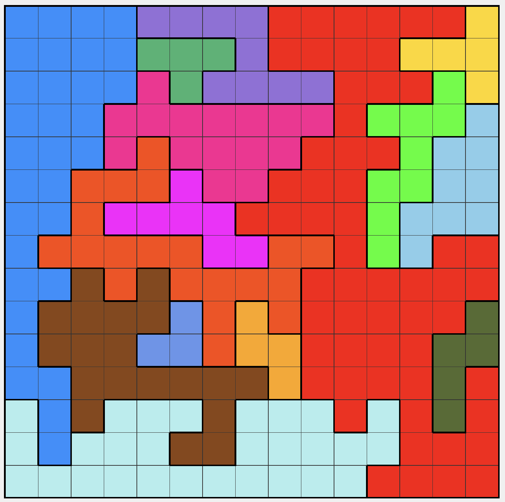

# Expert Queens

This repository contains code for a puzzle game based on a variant of the classic n-queens problem. Instead of simply placing n non-attacking queens on an n×n board, the board is also partitioned into n colored regions and each region must contain exactly one queen. Additionally, no two queens may be adjacent (even diagonally). 

Below is an example of a 15x15 board where 15 queens can be placed to satisfy these constraints in exactly one way.

## Background

I got quite obsessed with this LinkedIn game after a friend recommended it and started
playing it all the time. Eventually, I got a bit bored with the puzzles I could find online and wanted larger, more challenging boards
that were optimized for difficulty.

It turns out creating large boards of this game with unique solutions is quite 
tricky but after a lot of trial and error I managed to make it work with some fairly involved heuristics and logic. The logic can be found in `board_generator.py`. 

Play the puzzles I created at [expertqueens.com](expertqueens.com)! The boards there were selected
from thousands of generations to be as difficult and interesting to play as possible.
If you can solve game 7 or 10 of 15x15 kudos to you!
